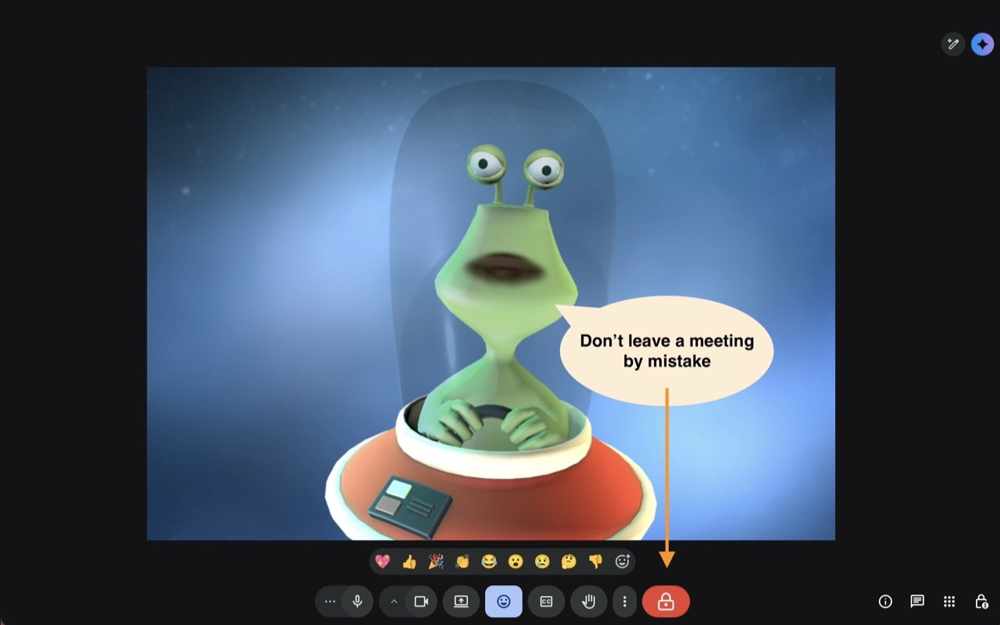
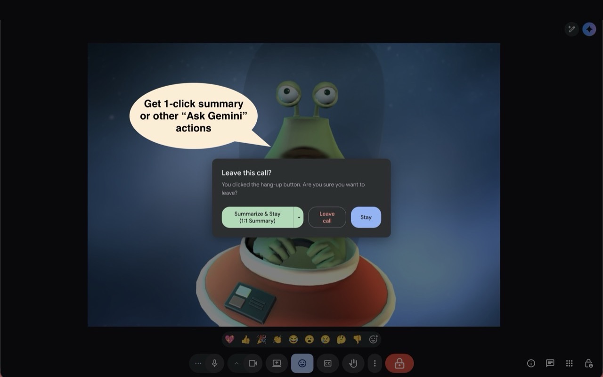
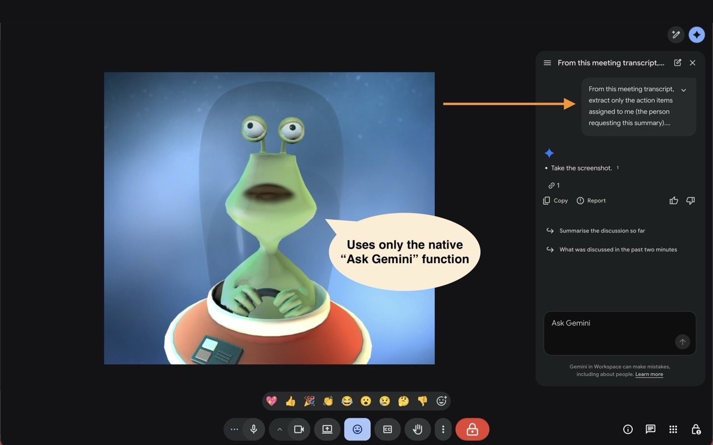
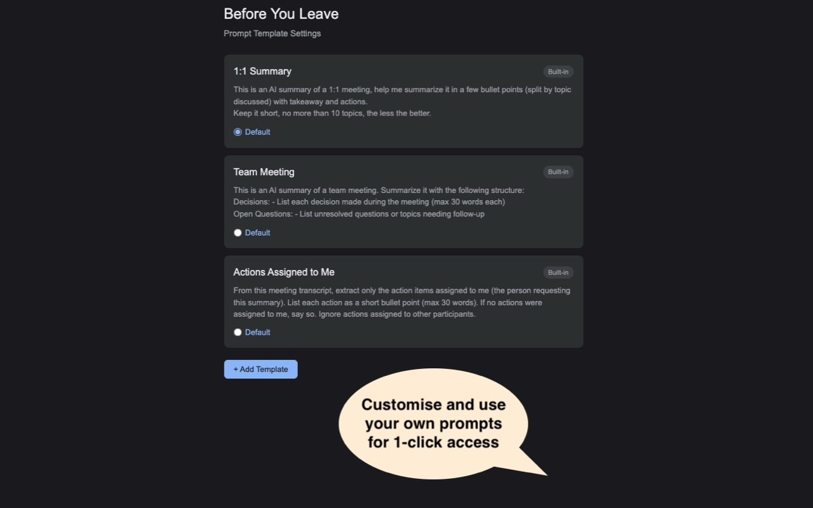

# Before You Leave

Never lose your Google Meet notes. A Chrome extension that guards the hang-up button and offers one-click AI summaries via Ask Gemini.

## Features

- **Hang-up guard** — lock overlay on the Leave call button prevents accidental hang-ups
- **One-click summarize** — "Summarize & Stay" sends a prompt to Gemini using your in-call transcript
- **Customizable templates** — configure prompt templates for different meeting types (1:1, team, actions)
- **Privacy-first** — zero network requests, no data collection, no tracking

## Screenshots

|                Lock overlay                 |                 Confirmation dialog                  |                 Prompt sent                 |                 Options page                  |
| :-----------------------------------------: | :--------------------------------------------------: | :-----------------------------------------: | :-------------------------------------------: |
|  |  |  |  |

## Install (unpacked)

1. Clone this repo
2. Open `chrome://extensions/` in Chrome
3. Enable **Developer mode** (top right)
4. Click **Load unpacked** and select this directory
5. Join a Google Meet call — the lock overlay appears on the Leave button

## Requirements

- Google Chrome
- Google Workspace with Gemini enabled (for the summarization feature; the hang-up guard works without Gemini)

## License

[MIT](LICENSE)
